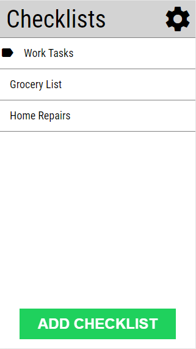

# Check-listify
Check-lisitfy is a simple to-do list tracker, with an emphasis placed on mobile and offline usage. It is also a Progressive Web App.

## Features

* Checklists and tasks created offline are automatically synced as soon as you go back online.
* Important lists can be pinned.
* Light and dark color themes are supported.

## Built With
* Database: AWS RDS running MySQL v5.7.22
* Server: Node v10.15.3 with Express v4.17.1. Authentication functionality provided by AWS Cognito
* Frontend: Vue v2.6.11

## Selfhosting
A guide to self-hosting can be found [here.](https://github.com/blake-buck/check-listify/wiki/Self-Hosting-Guide)

## Future Development

* Add mousedown/mouseup slide events to list items; if screen is narrow enough then desktop users may be unable to pin, update, and delete list items
* Create collaborative/shareable lists
* Add additional color themes
* Expand test coverage
* Clean up code surrounding database syncing
